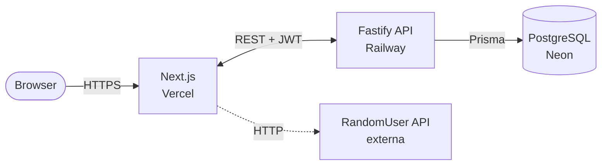
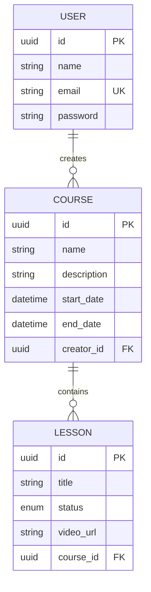

# CourseSphere

Plataforma de gestão de cursos online colaborativa. Usuários autenticados podem criar cursos, organizar aulas em rascunho ou publicadas, e visualizar uma turma ilustrativa carregada de uma API externa.

Projeto desenvolvido como desafio técnico para a vaga de estágio Full Stack na V-LAB.

## Sumário

- [Stack](#stack)
- [Arquitetura](#arquitetura)
- [Decisões técnicas](#decisões-técnicas)
- [Estrutura do monorepo](#estrutura-do-monorepo)
- [Modelo de dados](#modelo-de-dados)
- [API](#api)
- [Setup local](#setup-local)
- [Testes](#testes)
- [Deploy](#deploy)
- [Credenciais de teste](#credenciais-de-teste)

## Stack

**Backend:** Node.js, TypeScript, Fastify, Prisma, PostgreSQL, Zod, JWT, bcrypt
**Frontend:** Next.js 14 (App Router), TypeScript, Tailwind, shadcn/ui, TanStack Query, Axios, React Hook Form
**Infra:** Docker Compose (dev local), Railway (backend), Vercel (frontend), Neon (PostgreSQL gerenciado)
**Testes:** Jest + Supertest

## Arquitetura



O frontend nunca acessa o banco diretamente — toda mutação passa pela API. A chamada à RandomUser é feita do lado do cliente, sem persistência, apenas para enriquecer a tela de detalhes do curso com avatares fictícios de "alunos matriculados".

## Decisões técnicas

Esta seção documenta as escolhas não-óbvias do projeto. O documento original do desafio sugere Rails + React, mas permite outras stacks. Cada decisão abaixo foi tomada considerando o trade-off entre prazo de uma semana, qualidade de entrega, e o que minha experiência permite executar com confiança.

### Por que Node.js em vez de Rails

A vaga aparenta usar Rails no dia a dia, e há um peso óbvio em seguir a sugestão. Optei por Node.js porque é minha stack principal e isso me permite focar a semana em **qualidade de execução** em vez de aprender o framework durante o desafio. Um projeto bem estruturado em Node.js demonstra mais maturidade técnica do que um projeto mediano em Rails. A arquitetura do backend foi desenhada explicitamente em MVC para alinhar com a expectativa de quem avalia.

### Monorepo com backend e frontend separados

O documento lista *"separação clara entre backend e frontend"* como critério de prioridade alta. Considerei usar Next.js full-stack (API Routes + frontend no mesmo projeto), o que seria mais simples, mas optei por separar em `/backend` (Fastify) e `/frontend` (Next.js) dentro de um monorepo. Essa estrutura torna a separação cristalina para o avaliador e demonstra entendimento do contrato HTTP entre as duas camadas — em vez de borrá-lo com server actions ou route handlers.

### MVC explícito no backend

O backend segue MVC clássico: `controllers/` manipulam HTTP, `models/` concentram queries e regras de negócio, `routes/` registram endpoints. Controllers nunca acessam o Prisma diretamente — sempre passam pelo model correspondente. Essa disciplina mantém a camada HTTP fina e isola a lógica de domínio, o que facilita testes e simula o padrão Rails que o avaliador conhece.

### Fastify em vez de Express

Fastify foi escolhido pela validação de schema nativa, suporte first-class a TypeScript e padrões mais modernos. A diferença de performance não importa nesse contexto — o que importa é que o código gerado segue patterns mais coesos e atuais.

### Railway no backend, Vercel no frontend, Neon no banco

Vercel é serverless e foi feita para o Next.js — escolha óbvia para o frontend. Mas o Fastify é um servidor HTTP tradicional, que precisa de um processo persistente: Vercel não foi feita para isso. Railway é uma plataforma PaaS na mesma categoria do Heroku/Render, ideal para hospedar processos Node.js de longa duração. Neon é um PostgreSQL serverless gerenciado com tier gratuito generoso, e desacopla o banco da plataforma de aplicação — se um dia eu quisesse migrar do Railway para outro provedor, o banco continua independente.

### JWT manual em vez de NextAuth

O escopo da autenticação é simples: registrar, logar, validar token em rotas protegidas. NextAuth/Auth.js seria overkill e adicionaria dependências e abstração desnecessárias. JWT manual com `jsonwebtoken` é didático, transparente e demonstra entendimento do mecanismo de autenticação stateless — o que provavelmente é mais valioso para um avaliador do que mostrar que sei integrar uma biblioteca pronta.

### Considerações de segurança

A rota de registro **não revela** se um email já está cadastrado. Retornar uma mensagem específica como "email já existe" permite que um atacante enumere usuários do sistema apenas tentando se registrar. A resposta de erro é genérica para qualquer falha (validação ou duplicidade), e o usuário legítimo descobre que já tem conta ao tentar fazer login. A mesma lógica vale para o login: a mensagem é sempre "credenciais inválidas", nunca "email não encontrado" ou "senha incorreta" separadamente.

Senhas são armazenadas com hash bcrypt. JWT tem expiração configurável (default 7 dias). Todas as rotas de mutação verificam não só autenticação, mas autorização — só o criador de um curso pode editá-lo ou deletá-lo, e o mesmo vale para as aulas pertencentes a esse curso.

### Validação com Zod separada dos controllers

Schemas Zod ficam em `src/schemas/`, isolados dos controllers. Essa separação permite reutilizar o mesmo schema em testes, gerar tipos TypeScript via inferência, e manter os controllers focados em orquestração de HTTP em vez de mistura com lógica de validação.

## Estrutura do monorepo

```
coursesphere/
├── backend/
│   ├── src/
│   │   ├── controllers/      # manipulam HTTP, chamam models
│   │   ├── models/           # queries Prisma + regras de negócio
│   │   ├── routes/           # registram endpoints + middlewares
│   │   ├── middlewares/      # auth, error handling
│   │   ├── schemas/          # validação Zod
│   │   ├── lib/              # prisma client, jwt helpers
│   │   ├── app.ts            # setup Fastify
│   │   └── server.ts         # entry point
│   ├── prisma/schema.prisma
│   ├── tests/
│   └── jest.config.ts
├── frontend/
│   ├── src/
│   │   ├── app/              # rotas (App Router)
│   │   ├── components/       # ui (shadcn), courses, lessons, shared
│   │   ├── services/         # Axios + serviços de API
│   │   ├── hooks/            # TanStack Query
│   │   ├── contexts/         # AuthContext
│   │   └── types/
├── docker-compose.yml        # PostgreSQL local
└── README.md
```

## Modelo de dados



IDs são UUIDs (em vez de auto-increment) para evitar enumeration attacks via URL. Cascade delete está configurado em ambas as relações: deletar um usuário remove seus cursos, deletar um curso remove suas aulas.

## API

Base URL: `/api`. Rotas protegidas requerem header `Authorization: Bearer <token>`.

| Método | Rota | Auth | Descrição |
|--------|------|------|-----------|
| POST | `/auth/register` | — | Cria usuário e retorna JWT |
| POST | `/auth/login` | — | Autentica e retorna JWT |
| GET | `/courses` | ✓ | Lista cursos (suporta `?search=`) |
| GET | `/courses/:id` | ✓ | Detalhes do curso com aulas |
| POST | `/courses` | ✓ | Cria curso |
| PUT | `/courses/:id` | ✓ criador | Atualiza curso |
| DELETE | `/courses/:id` | ✓ criador | Remove curso |
| GET | `/courses/:courseId/lessons` | ✓ | Lista aulas (suporta `?status=`) |
| POST | `/courses/:courseId/lessons` | ✓ criador | Cria aula |
| PUT | `/courses/:courseId/lessons/:id` | ✓ criador | Atualiza aula |
| DELETE | `/courses/:courseId/lessons/:id` | ✓ criador | Remove aula |

Validação de regras de negócio: `endDate >= startDate` em cursos, `title >= 3 chars` em ambos, `videoUrl` deve ser URL válida quando informado, `status` aceita apenas `draft` ou `published`.

## Setup local

**Pré-requisitos:** Node 20+, Docker, npm.

1. Clonar o repositório:
   ```bash
   git clone <repo-url> coursesphere && cd coursesphere
   ```

2. Copiar os arquivos de ambiente:
   ```bash
   cp .env.example .env
   cp backend/.env.example backend/.env
   cp frontend/.env.example frontend/.env
   ```

3. Subir o PostgreSQL local:
   ```bash
   docker compose up -d
   ```

4. Backend:
   ```bash
   cd backend
   npm install
   npx prisma migrate dev
   npm run dev
   ```
   API disponível em `http://localhost:3333`.

5. Frontend (em outro terminal):
   ```bash
   cd frontend
   npm install
   npm run dev
   ```
   App disponível em `http://localhost:3000`.

## Testes

Os testes do backend cobrem as regras de negócio críticas: validação de datas em cursos, autorização (apenas o criador edita/deleta), e fluxo de autenticação.

```bash
cd backend
npm test
```

## Deploy

> _Links a serem preenchidos após deploy._

- **Frontend (Vercel):** —
- **Backend (Railway):** —
- **Banco (Neon):** PostgreSQL gerenciado, conectado via `DATABASE_URL`.

## Credenciais de teste

> _A serem preenchidas após o deploy. O fluxo de registro está disponível e funcional para criação de novos usuários._

## Diário de desenvolvimento

### Dia 1 — Fundação e autenticação

Defini a stack e a arquitetura antes de escrever qualquer linha de código. Optei por **Node.js + Fastify** no backend em vez de Rails (sugestão do desafio) por ser minha stack principal — escolha racional pelo prazo de uma semana, com arquitetura MVC explícita pra alinhar com a expectativa de quem avalia. Frontend ficou com **Next.js + Tailwind + shadcn/ui** em monorepo separado, deixando o contrato HTTP entre as duas camadas explícito em vez de borrá-lo com server actions.

Setup inicial cobriu monorepo, schema Prisma com `User`, `Course` e `Lesson` (UUIDs e cascade delete), `docker-compose` para PostgreSQL local, e a infraestrutura base do Fastify (CORS, error handler global, singleton do Prisma, helpers de JWT, middleware de autenticação).

Implementei o **módulo de autenticação completo** com registro e login. Decisões de segurança que vale destacar: senha com hash bcrypt, mensagens de erro genéricas em ambos os endpoints para evitar enumeração de emails, e payload do JWT contendo apenas `userId` (não `email`, que é mutável e expõe dado pessoal desnecessariamente já que JWT é apenas assinado, não criptografado). Cobertura de testes com Jest + Supertest validando os fluxos críticos: registro válido, email duplicado, login válido, credenciais inválidas.

Revisando o controller de auth depois de pronto, percebi que o hash da senha estava sendo feito ali — o que tecnicamente é regra de negócio vazando pra camada HTTP. Refatorei movendo o `bcrypt.hash` pra dentro do `createUser` no model, e a verificação de senha pra um helper `verifyUserPassword` também no model. O controller ficou verdadeiramente HTTP-only: valida input, chama o model, retorna status. Pequena mudança, mas consolida a separação MVC que é critério explícito de avaliação.

**Stack confirmada ao final do dia:** Fastify · TypeScript · Prisma · PostgreSQL · Zod · JWT · bcrypt · Jest · Next.js · Tailwind · shadcn/ui · TanStack Query.